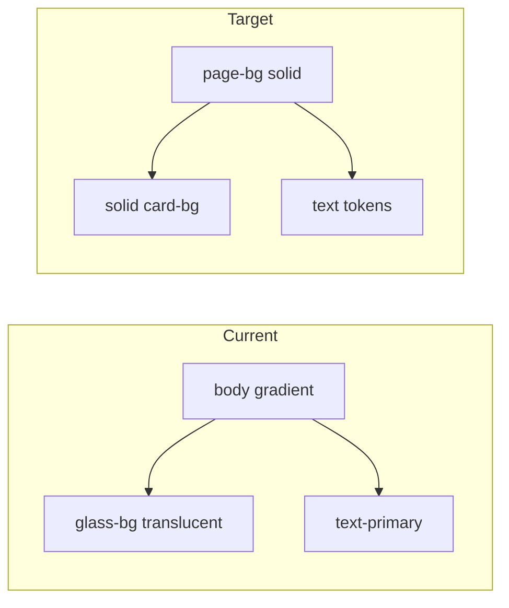

# Fix page background and text readability

## Problem

The unreadable hero in your screenshot comes from [`src/app/globals.css`](src/app/globals.css), not from the hero module itself:

```57:58:src/app/globals.css
  background: linear-gradient(135deg, var(--gradient-start) 0%, var(--gradient-end) 100%);
  background-attachment: fixed;
```

`--text-primary` (#0B1F3F) and the cyan gradient accent on “Spend Less.” sit on that saturated blue canvas, so contrast collapses. Theme switching via `data-theme` on `<html>` ([`src/app/layout.tsx`](src/app/layout.tsx)) is already correct; the palette assumes a gradient behind semi-transparent “glass” UI.



## Approach (token-first, minimal churn)

Keep glassmorphism as **elevated solid cards** on a flat page (borders + shadow), not frosted panels over a gradient. Most of the app already uses `var(--glass-bg)`, `var(--glass-border)`, and `.glass-panel` — updating tokens in one place fixes the home page, listings, auth, and dashboard without restructuring components.

### 1. Page background and core tokens — [`src/app/globals.css`](src/app/globals.css)

| Token | Light | Dark |
|-------|-------|------|
| New `--page-bg` | `#FFFFFF` (or `#FAFBFC` if you want a hair off-white) | existing `--surface` tone `#0B1424` |
| `html, body` `background` | `var(--page-bg)` | same (via `[data-theme='dark']`) |
| `--glass-bg` / `--card-bg` | opaque white `#FFFFFF` | elevated panel e.g. `#121C2E` |
| `--glass-border` | neutral border e.g. `rgba(11, 31, 63, 0.12)` | keep subtle light border |
| `--glass-shadow` | soft neutral shadow (no cyan glow) | darker shadow |
| New `--input-bg` | `#FFFFFF` or `#F8FAFC` | `#151f33` |
| New `--hover-surface` | `rgba(11, 31, 63, 0.06)` | `rgba(255, 255, 255, 0.08)` |

- Remove or stop using `--gradient-start` / `--gradient-end` on `body` (can leave variables unused or delete later).
- Update **global** `input, select, textarea` rules (lines 112–123): replace `background: rgba(255, 255, 255, 0.1)` with `var(--input-bg)` and a readable border.
- Tune `.glass-panel-hover:hover` so the hover border/shadow works on white (less cyan-heavy).
- Optional: `[data-theme='dark'] ::-webkit-scrollbar-track` for a darker track.

**Hero** ([`src/app/page.module.css`](src/app/page.module.css)): no section-specific background needed; `.heroTitle` / `.heroSubtitle` already use `--text-primary` / `--text-secondary` and will read correctly once `body` is solid. Keep `.heroAccent` gradient text — it works on white and dark page backgrounds.

### 2. Replace hardcoded “white overlay” hovers — shared UI modules

These files use `rgba(255, 255, 255, 0.08–0.15)` for inputs/hovers, which vanishes on a white page:

- [`src/components/layout/Navbar/Navbar.module.css`](src/components/layout/Navbar/Navbar.module.css) — `.btnSecondary:hover`, `.menuButton:hover`
- [`src/components/ui/Button/Button.module.css`](src/components/ui/Button/Button.module.css) — `.secondary:hover`
- [`src/components/ui/Input/Input.module.css`](src/components/ui/Input/Input.module.css) — `.input` / `:focus` backgrounds
- [`src/components/ui/Select/Select.module.css`](src/components/ui/Select/Select.module.css) — same pattern if present

Switch to `var(--input-bg)`, `var(--hover-surface)`, and `var(--glass-border)`.

### 3. Secondary polish (same PR, low risk)

Update remaining `rgba(255, 255, 255, …)` in page-level modules so listing badges and dashboard chips don’t look washed out on white:

- [`src/app/page.module.css`](src/app/page.module.css) — `.badge` background
- [`src/app/(auth)/auth.module.css`](src/app/(auth)/auth.module.css), [`src/app/listings/page.module.css`](src/app/listings/page.module.css), [`src/app/dashboard/page.module.css`](src/app/dashboard/page.module.css) — badge/chip overlays → `var(--hover-surface)` or a small `--badge-bg` token in `globals.css` if reused

Navbar/header/footer can keep `backdrop-filter` for a subtle effect, or drop blur once backgrounds are opaque (cosmetic only).

### 4. Verification

With `npm run dev` already running:

1. **Light** — `/`: white page, navy headline, gray subtitle, search field with visible border, Log In outline readable.
2. **Dark** — toggle moon icon: dark page, light text, cards slightly elevated from background.
3. Spot-check `/listings`, `/login`, `/dashboard` for inputs and secondary buttons on hover.

No changes to [`ThemeToggle.tsx`](src/components/layout/ThemeToggle/ThemeToggle.tsx) or layout cookie logic unless a flash-of-wrong-theme appears (unlikely).

## Out of scope (unless you want it next)

- Updating [`page237-final-agent-prompt.md`](page237-final-agent-prompt.md) design spec (still describes gradient background).
- Rewriting inline `style={{ background: 'rgba(255, 255, 255, 0.08)' }}` in a few TSX files — many will improve via `.glass-panel` token changes; only touch if still low-contrast after globals pass.

## Files touched (expected)

| Priority | File |
|----------|------|
| Required | [`src/app/globals.css`](src/app/globals.css) |
| Required | Navbar, Button, Input, Select module CSS |
| Optional polish | `page.module.css`, auth/listings/dashboard module CSS |
