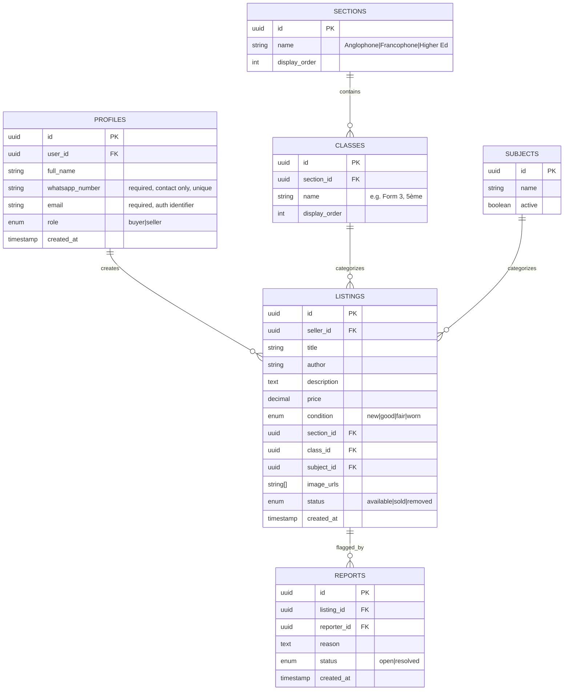
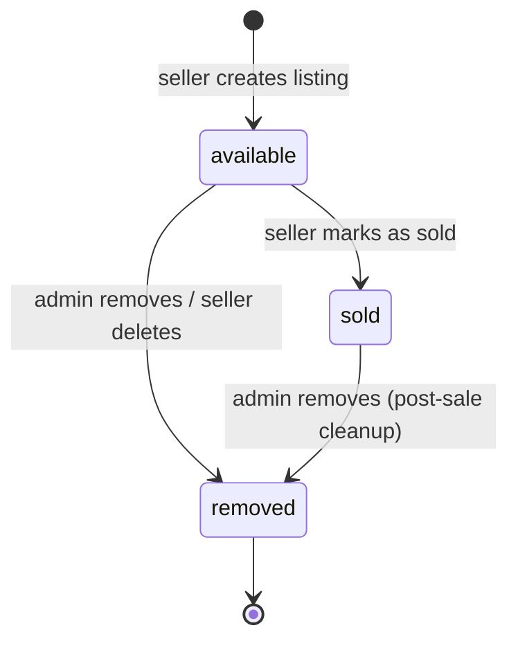
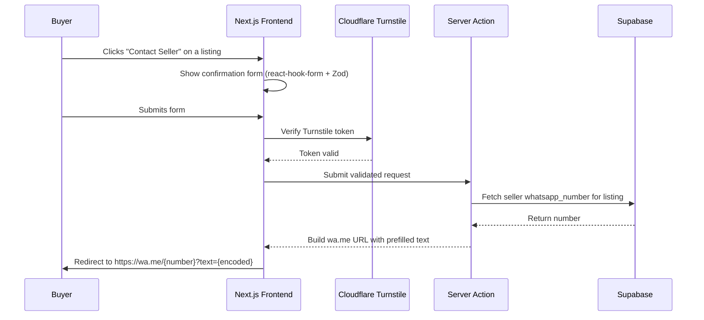
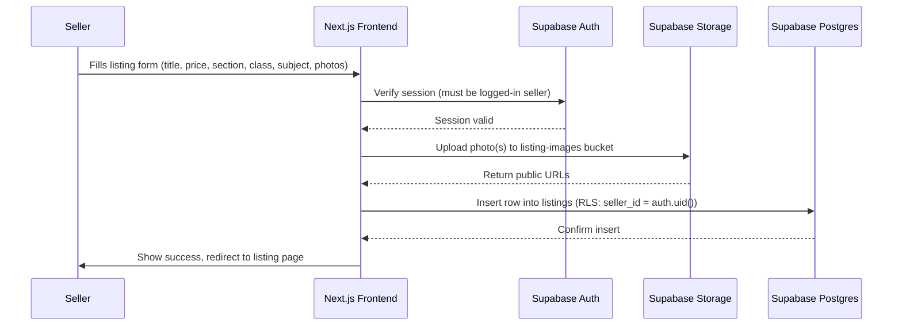

# Project Prompt: Page237 — Second-Hand Book/Pamphlet Marketplace

## Context
This is agentic coding, not vibe coding — plan before you build, explain
tradeoffs, and don't silently scaffold things I didn't ask for. I have a
coding background, so skip beginner-level explanations; give me the technical
reasoning. Project name: **Page237**.

## Note:
The Next.js project is already scaffolded and all dependencies (@supabase/supabase-js, react-hook-form, zod, lucide-react, etc.) are already installed. Don't re-scaffold — work inside the existing project structure."

## Tech Stack (decided — don't re-litigate unless there's a real problem)

| Layer | Choice |
|---|---|
| Framework | Next.js (App Router, TypeScript) |
| Styling | **Plain CSS** — CSS Modules per component + `globals.css` with CSS custom properties for design tokens. No Tailwind. |
| Backend / DB | Supabase (Postgres + Auth + Storage + Row Level Security) |
| Auth | Supabase standard email/password auth |
| Form handling | react-hook-form + Zod resolver (schema-driven validation, see note below) |
| Icons | lucide-react (clean line icons, works standalone without Tailwind) |
| Bot protection | Cloudflare Turnstile (works now, no domain needed) |
| Hosting | Vercel (free tier) — **two separate projects**: public app + admin app |
| Domain | None yet — starting on default `*.vercel.app` URLs |
| WhatsApp integration | Plain `wa.me` deep link, no API/approval needed |

**react-hook-form + Zod, briefly:** react-hook-form manages form state
efficiently (no re-render per keystroke). Zod defines a schema once (what a
valid signup/listing object looks like) and gives you both runtime validation
and inferred TypeScript types from that one definition — react-hook-form's
Zod resolver wires the two together so there's no duplicated validation logic
between client and server.

## Cloudflare status (important — don't over-build this yet)
- ✅ **Turnstile**: set up now, works fine on a `.vercel.app` hostname, no
  domain ownership required. Use on signup and the contact-seller form.
- ❌ **Bot Fight Mode, WAF, Cloudflare Access**: all require nameserver
  control over a real domain. **Not usable yet.** Don't build anything that
  assumes these exist. Revisit once a domain is purchased.
- Interim admin protection (until there's a domain + Access): strong
  server-side session/role checks (never a client-side-only check), Turnstile
  on the admin login form, and the admin app's URL simply isn't linked from
  anywhere public.

## Roles & Core Flow
1. **Seller**: creates an account (full name, WhatsApp number, email,
   password — all required), posts listings.
2. **Buyer**: browses/searches/filters listings publicly. Contacting a seller
   requires being logged in (confirm if you'd rather make browsing itself
   gated too — current default is public browsing).
3. **Contact handoff**: buyer selects a listing → validated confirmation form
   (Zod + react-hook-form, Turnstile-protected) → redirect to
   `https://wa.me/{sellerNumber}?text={encoded}` with a prefilled message
   referencing the specific listing.
4. **Admin (me, sole admin)**: separate Vercel project/URL, full CRUD over
   listings, users, and the Section/Class/Subject taxonomy, plus basic stats
   and report resolution.

## Use Case Diagram

```mermaid
graph TB
    Buyer((Buyer))
    Seller((Seller))
    Admin((Admin))

    Buyer --> UC1[Browse/search listings]
    Buyer --> UC2[Filter by section/class/subject/price/condition]
    Buyer --> UC3[Contact seller via WhatsApp]
    Buyer --> UC4[Report a listing]

    Seller --> UC1
    Seller --> UC5[Create account]
    Seller --> UC6[Post listing]
    Seller --> UC7[Edit/delete own listing]
    Seller --> UC8[Mark listing as sold]

    Admin --> UC9[Manage sections/classes/subjects]
    Admin --> UC10[Moderate: remove/flag any listing]
    Admin --> UC11[Manage user accounts]
    Admin --> UC12[View platform stats]
    Admin --> UC13[Resolve reports]
```



## Data Model



**Key rules:**
- `role` is only ever `buyer` or `seller` — never selectable as `admin`
  anywhere in the public app. Admin status is a manual, out-of-band flag on
  my account directly in Supabase (one-off DB update or a hardcoded
  `user_id` check) — there is exactly one admin.
- `Sections`, `Classes`, and `Subjects` are **admin-managed database tables**,
  not hardcoded enums — I need to add/edit these myself from the admin
  dashboard without touching code.
- Seed data: **Anglophone** (Nursery, Class 1–6, Form 1–5, Lower/Upper
  Sixth), **Francophone** (Maternelle, SIL, CP–CM2, 6ème–3ème, 2nde, 1ère,
  Terminale), **Higher Ed / General** (University, Professional, General
  Reading).
- RLS: sellers manage only their own listings; buyers have read-only access
  to `available` listings; admin (checked via the manual flag) has full
  access to everything.

## Auth Flow
- Standard Supabase email/password signup — email is the real login
  identifier, "Confirm email" enabled, password reset uses Supabase's
  built-in flow (real emails, no workarounds).
- WhatsApp number is a required, unique, normalized field on the profile
  (contact purposes only — not used for login).

## Listing Status — State Diagram



## Key Sequence Flows





## Design System

**Visual style:** premium glassmorphism — a fixed diagonal gradient
background with frosted, blurred glass cards floating above it.

**Color tokens (Deep Blue → Electric Cyan), light mode default:**

```css
:root {
  --gradient-start: #0B1F3F;
  --gradient-end: #00D4FF;
  --glass-bg: rgba(255, 255, 255, 0.55);
  --glass-border: rgba(255, 255, 255, 0.35);
  --text-primary: #0B1F3F;
  --text-secondary: #4A5A75;
  --accent: #00A8CC;
  --surface: #F4F8FB;
}

[data-theme='dark'] {
  --gradient-start: #060E1F;
  --gradient-end: #0090B0;
  --glass-bg: rgba(15, 23, 42, 0.55);
  --glass-border: rgba(255, 255, 255, 0.08);
  --text-primary: #E6F1FF;
  --text-secondary: #9DB2CE;
  --accent: #00D4FF;
  --surface: #0B1424;
}
```

Glass cards: `background: var(--glass-bg)`, `backdrop-filter: blur(14px)`,
1px `var(--glass-border)`, soft shadow. Light mode is default; toggle
persists via a `data-theme` attribute stored in a cookie or on the user's
Supabase profile (not localStorage).

**Icons:** lucide-react throughout — clean, minimal, consistent stroke
weight.

**Responsiveness:** fully responsive. Desktop nav is a horizontal bar;
mobile collapses into a hamburger menu with a slide-in drawer. No fixed
breakpoint assumptions — test at common widths (375, 768, 1024, 1440).

## Filter Bar (Vinted-style)

Desktop: horizontal row of dropdown chips —
`Section ▾` `Class ▾` `Subject ▾` `Condition ▾` `Price ▾` `Sort by ▾`
— `Section` and `Class` cascade (choosing a Section filters available
Classes). Each chip opens a small panel with checkboxes + an "Apply" button,
not a full page navigation. Active filters show as removable pills below the
bar.

Mobile: collapses into a single "Filters" button opening a bottom sheet with
the same fields stacked, plus a persistent "Sort by" shortcut.

## Sample Page Structure

```
[Listing card - grid item]
┌─────────────────────────┐
│  [cover image, glass    │
│   overlay on hover]     │
│  Title (truncated)      │
│  Author                 │
│  Class · Condition      │
│  Price          ❤ save  │
└─────────────────────────┘

[Listing detail page]
- Image gallery (main + thumbnails)
- Title / Author
- Price (large, prominent)
- Badges: Section | Class | Subject | Condition
- Description
- Seller mini-card (name, member since — NOT phone number shown directly)
- [Contact Seller on WhatsApp] button → confirmation form → wa.me
- Report listing (small, low-emphasis link)
```

## `.env.local` Template

```bash
# --- Supabase ---
NEXT_PUBLIC_SUPABASE_URL=
NEXT_PUBLIC_SUPABASE_ANON_KEY=
SUPABASE_SERVICE_ROLE_KEY=          # server-only, NEVER expose to client

# --- Cloudflare Turnstile (bot protection) ---
NEXT_PUBLIC_TURNSTILE_SITE_KEY=
TURNSTILE_SECRET_KEY=

# --- App ---
NEXT_PUBLIC_SITE_URL=http://localhost:3000
```

## `.gitignore`

```gitignore
# Next.js
.next/
out/
build/

# Dependencies
node_modules/
.pnp
.pnp.js

# Env files — never commit real secrets
.env
.env.local
.env.*.local

# Vercel
.vercel

# Debug
npm-debug.log*
yarn-debug.log*
yarn-error.log*
.pnpm-debug.log*

# OS
.DS_Store
Thumbs.db

# Editor
.vscode/*
!.vscode/extensions.json
.idea/

# TypeScript
*.tsbuildinfo
next-env.d.ts

# Testing
coverage/
```

## Services & Keys — set these up BEFORE prompting the agent

| Service | What to do | Where you get the key |
|---|---|---|
| Supabase | Create a project (free tier) | Project Settings → API → `URL`, `anon key`, `service_role key` |
| Supabase Auth | Enable Email/Password (default), enable "Confirm email", configure password-reset template | Authentication → Providers |
| Supabase Storage | Create a `listing-images` bucket, public read | Storage tab |
| Cloudflare Turnstile | Create a widget for your `.vercel.app` hostname | Turnstile tab → `Site Key` + `Secret Key` |
| Vercel | Connect GitHub repo; create it as **two separate projects** (public app + admin app); add env vars to each | — |
| WhatsApp | Nothing to set up | — |

## What I want from you, in order
1. **Plan first.** Confirm folder structure, the exact Supabase schema + RLS
   policies as SQL, and the route list for both the public app and the
   separate admin app. Wait for my confirmation before writing code.
2. **Build incrementally:**
   - Supabase schema + RLS (as a migration file), seed Sections/Classes
   - Auth (signup/login, session handling)
   - Seller: create/edit/delete listing, image upload to Storage
   - Public: browse/search/filter listings (Vinted-style filter bar)
   - Buyer: contact-seller flow → Turnstile → validated form → wa.me redirect
   - Admin app (separate Vercel project): listing moderation, user list,
     taxonomy management (Sections/Classes/Subjects CRUD), basic stats,
     report resolution
   - Light/dark theme toggle
3. After each chunk, tell me exactly what to test manually before moving on.
4. Flag any place where free-tier limits (Supabase storage/row limits,
   Vercel build minutes/bandwidth) could bite me later.
5. Keep dependencies minimal — no heavy library where a small utility
   function does the job.

## Guardrails
- No Tailwind — plain CSS Modules + custom properties only.
- No WhatsApp Business API — the `wa.me` link is intentional and final.
- No OAuth providers unless I explicitly ask.
- No Cloudflare Bot Fight Mode/WAF/Access setup yet — no domain to support it.
- Never expose `role: admin` as a settable value anywhere in the public app.
- If something here is ambiguous, ask one specific question rather than
  guessing silently and building the wrong thing.
